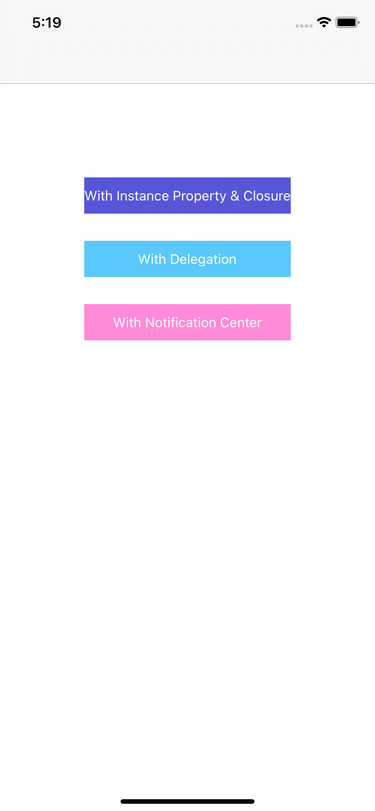
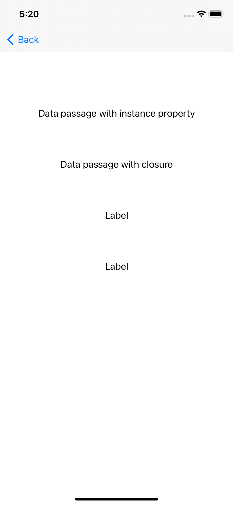
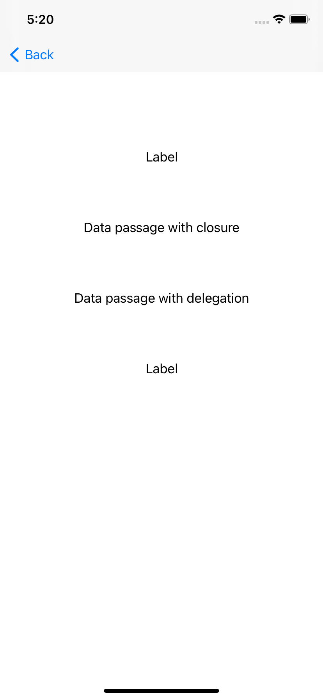
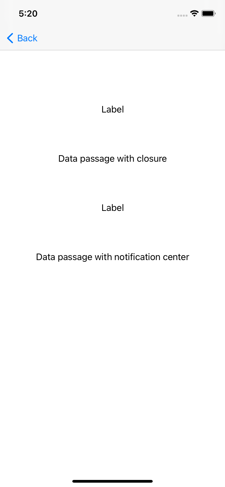

# Data-Passage-Between-View-Controllers

- In this project, I have made an example for each data passage technique below using Swift:

  - Instance Property
  - Closure
  - Delegation Pattern
  - Notification Center
  
  
- There are 3 UIButtons in View Controller. 
- Second View Controller consists of 4 UILabels:
  - 1 -> data coming with using Instance Property
  - 2 -> data coming with using Closure
  - 3 -> data coming with using Delegation Pattern
  - 4 -> data coming with using Notification Center
  
    
  
 - Every button is responsible for a data passage technique except for closure.
 - Although I wrote "With Instance Property & Closure" to the first button's title, you will see the closure's data whichever button you click. 
  Because I made the closure call in Second View Controller's viewDidLoad method. All you have to do is, navigate to the Second View Controller somehow to see the data coming from closure.
- In the meantime, you must click their own buttons to make the data passage with delegation and notification center.

      
  
